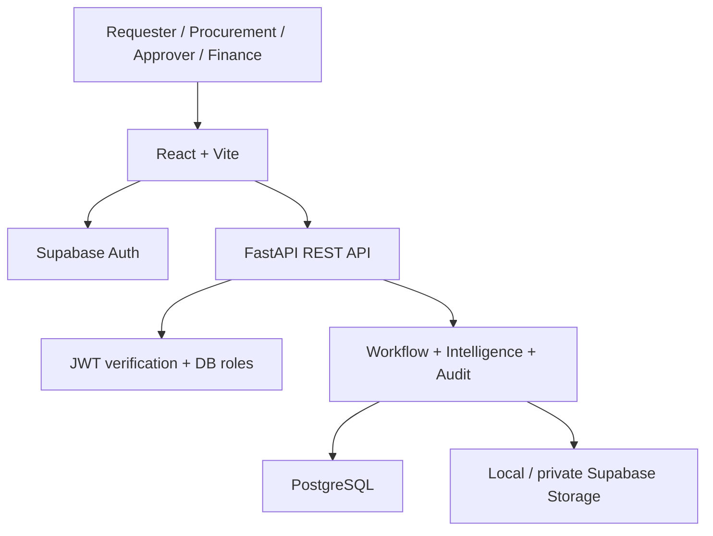

# Architecture
A modular monolith: React browser application, one FastAPI deployment, PostgreSQL and Supabase identity/storage. Backend service logic controls states, prices and permissions. No browser direct database access.

## Module boundaries
`core`: configuration, sessions, bearer authentication. `schemas`: strict Pydantic requests. `routers`: endpoint orchestration and role gates. `services/workflow`: access, state guards, audit and views. `services/intelligence`: deterministic money/price/risk calculations. `services/storage`: signature validation, random keys, SHA-256 and protected retrieval. `models`: relational persistence. The router file is intentionally compact for this delivery; split it by vertical module as the team expands the project.

One request owns one transaction; row locks serialize changes to the same requisition on PostgreSQL. DB uniqueness constraints defend duplicate invitations, quotes, approval levels and POs. File bytes are written before document metadata commits: storage failure leaves no document record; a later DB failure can leave an unreferenced object (documented cleanup limitation).

JWT claims prove identity only. App roles are resolved from the database each request. RLS with no client policies prevents anonymous/authenticated Supabase Data API access to application tables. Backend uses the table-owning connection. Supabase service role stays server-side.

Operational counters are per-process memory, reset on restart and are not durable monitoring. Logs include request IDs, route, status and latency without bearer tokens or body content.
