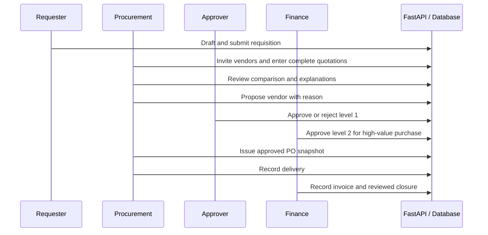
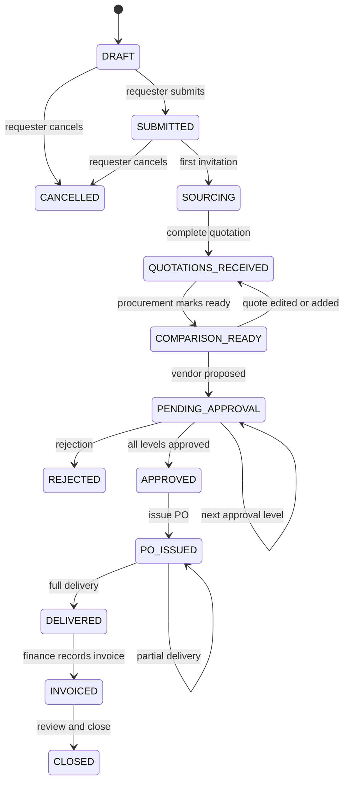

# Data flow and workflow

Terminal rejected/cancelled records remain read-only; create a new request to revise them. There is no arbitrary status-update endpoint. Every business mutation validates the current state. GET comparison is read-only; POST recalculate records readiness and audit. It uses the persisted line analysis calculated at quotation entry/edit, preserving what was evaluated. Taxes apply after a currency-amount discount on each line, rounded half-up to two decimals.
