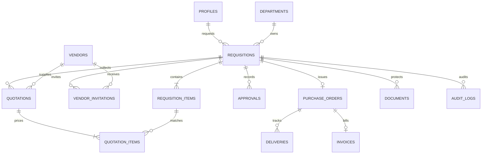

# Database schema

Primary keys are integer IDs. Money uses Numeric(16,2), quantity Numeric(12,3); API totals serialize as JSON numbers. Foreign keys and uniqueness constraints enforce links. Database schema is produced from SQLAlchemy metadata; Alembic is the migration authority.

## approval_rules
| Field | SQL type | Nullable | Reference |
|---|---|---|---|
| id | INTEGER | False | — |
| name | VARCHAR(100) | False | — |
| min_amount | NUMERIC(16, 2) | False | — |
| max_amount | NUMERIC(16, 2) | True | — |
| required_role | VARCHAR(30) | False | — |
| level | INTEGER | False | — |
| active | BOOLEAN | False | — |

## departments
| Field | SQL type | Nullable | Reference |
|---|---|---|---|
| id | INTEGER | False | — |
| name | VARCHAR(120) | False | — |
| cost_center | VARCHAR(40) | False | — |

## price_history
| Field | SQL type | Nullable | Reference |
|---|---|---|---|
| id | INTEGER | False | — |
| item_name | VARCHAR(120) | False | — |
| category | VARCHAR(80) | False | — |
| unit | VARCHAR(30) | False | — |
| unit_price | NUMERIC(16, 2) | False | — |
| observed_at | DATE | False | — |
| source | VARCHAR(120) | False | — |

## vendors
| Field | SQL type | Nullable | Reference |
|---|---|---|---|
| id | INTEGER | False | — |
| name | VARCHAR(120) | False | — |
| email | VARCHAR(254) | False | — |
| contact | VARCHAR(80) | True | — |
| active | BOOLEAN | False | — |
| created_at | DATETIME | True | — |

## profiles
| Field | SQL type | Nullable | Reference |
|---|---|---|---|
| id | INTEGER | False | — |
| supabase_user_id | VARCHAR(64) | False | — |
| email | VARCHAR(254) | False | — |
| name | VARCHAR(120) | False | — |
| role | VARCHAR(30) | False | — |
| department_id | INTEGER | True | departments.id |
| active | BOOLEAN | False | — |
| created_at | DATETIME | False | — |

## vendor_history
| Field | SQL type | Nullable | Reference |
|---|---|---|---|
| id | INTEGER | False | — |
| vendor_id | INTEGER | False | vendors.id |
| total_orders | INTEGER | False | — |
| completed_orders | INTEGER | False | — |
| late_deliveries | INTEGER | False | — |
| anomalous_lines | INTEGER | False | — |
| quotation_lines | INTEGER | False | — |
| disputed_orders | INTEGER | False | — |
| incomplete_orders | INTEGER | False | — |
| invoice_mismatches | INTEGER | False | — |
| invoiced_orders | INTEGER | False | — |

## requisitions
| Field | SQL type | Nullable | Reference |
|---|---|---|---|
| id | INTEGER | False | — |
| requester_id | INTEGER | False | profiles.id |
| department_id | INTEGER | False | departments.id |
| title | VARCHAR(180) | False | — |
| justification | VARCHAR(2000) | False | — |
| status | VARCHAR(32) | False | — |
| estimated_total | NUMERIC(16, 2) | False | — |
| preferred_vendor_id | INTEGER | True | vendors.id |
| approval_plan | JSON | True | — |
| created_at | DATETIME | True | — |
| submitted_at | DATETIME | True | — |

## approvals
| Field | SQL type | Nullable | Reference |
|---|---|---|---|
| id | INTEGER | False | — |
| requisition_id | INTEGER | False | requisitions.id |
| approver_id | INTEGER | False | profiles.id |
| approval_level | INTEGER | False | — |
| decision | VARCHAR(20) | False | — |
| comment | VARCHAR(2000) | False | — |
| decided_at | DATETIME | True | — |

## audit_logs
| Field | SQL type | Nullable | Reference |
|---|---|---|---|
| id | INTEGER | False | — |
| actor_user_id | INTEGER | True | profiles.id |
| requisition_id | INTEGER | True | requisitions.id |
| action | VARCHAR(80) | False | — |
| entity_type | VARCHAR(60) | False | — |
| entity_id | INTEGER | False | — |
| timestamp | DATETIME | False | — |
| details | JSON | False | — |

## purchase_orders
| Field | SQL type | Nullable | Reference |
|---|---|---|---|
| id | INTEGER | False | — |
| requisition_id | INTEGER | False | requisitions.id |
| vendor_id | INTEGER | False | vendors.id |
| po_number | VARCHAR(60) | False | — |
| total | NUMERIC(16, 2) | False | — |
| issued_at | DATETIME | True | — |
| status | VARCHAR(30) | True | — |
| snapshot_json | JSON | False | — |

## quotations
| Field | SQL type | Nullable | Reference |
|---|---|---|---|
| id | INTEGER | False | — |
| requisition_id | INTEGER | False | requisitions.id |
| vendor_id | INTEGER | False | vendors.id |
| quotation_number | VARCHAR(80) | False | — |
| quotation_date | DATE | False | — |
| valid_until | DATE | True | — |
| delivery_days | INTEGER | False | — |
| delivery_terms | VARCHAR(500) | True | — |
| subtotal | NUMERIC(16, 2) | False | — |
| tax_total | NUMERIC(16, 2) | False | — |
| discount_total | NUMERIC(16, 2) | False | — |
| grand_total | NUMERIC(16, 2) | False | — |
| created_at | DATETIME | True | — |

## requisition_items
| Field | SQL type | Nullable | Reference |
|---|---|---|---|
| id | INTEGER | False | — |
| requisition_id | INTEGER | False | requisitions.id |
| item_name | VARCHAR(120) | False | — |
| category | VARCHAR(80) | False | — |
| description | VARCHAR(500) | True | — |
| quantity | NUMERIC(12, 3) | False | — |
| unit | VARCHAR(30) | False | — |
| estimated_unit_price | NUMERIC(16, 2) | False | — |
| estimated_line_total | NUMERIC(16, 2) | False | — |

## vendor_invitations
| Field | SQL type | Nullable | Reference |
|---|---|---|---|
| id | INTEGER | False | — |
| requisition_id | INTEGER | False | requisitions.id |
| vendor_id | INTEGER | False | vendors.id |
| invited_at | DATETIME | True | — |
| status | VARCHAR(30) | True | — |
| response_at | DATETIME | True | — |

## deliveries
| Field | SQL type | Nullable | Reference |
|---|---|---|---|
| id | INTEGER | False | — |
| purchase_order_id | INTEGER | False | purchase_orders.id |
| status | VARCHAR(30) | False | — |
| delivered_at | DATE | False | — |
| notes | VARCHAR(2000) | False | — |

## invoices
| Field | SQL type | Nullable | Reference |
|---|---|---|---|
| id | INTEGER | False | — |
| purchase_order_id | INTEGER | False | purchase_orders.id |
| invoice_number | VARCHAR(80) | False | — |
| invoice_date | DATE | False | — |
| amount | NUMERIC(16, 2) | False | — |
| status | VARCHAR(30) | False | — |
| mismatch_flag | BOOLEAN | False | — |
| mismatch_reason | VARCHAR(500) | False | — |
| resolution_comment | VARCHAR(2000) | True | — |

## quotation_items
| Field | SQL type | Nullable | Reference |
|---|---|---|---|
| id | INTEGER | False | — |
| quotation_id | INTEGER | False | quotations.id |
| requisition_item_id | INTEGER | False | requisition_items.id |
| unit_price | NUMERIC(16, 2) | False | — |
| quantity | NUMERIC(12, 3) | False | — |
| tax | NUMERIC(16, 2) | False | — |
| discount | NUMERIC(16, 2) | False | — |
| line_total | NUMERIC(16, 2) | False | — |
| analysis | JSON | False | — |

## documents
| Field | SQL type | Nullable | Reference |
|---|---|---|---|
| id | INTEGER | False | — |
| requisition_id | INTEGER | False | requisitions.id |
| quotation_id | INTEGER | True | quotations.id |
| invoice_id | INTEGER | True | invoices.id |
| storage_key | VARCHAR(200) | False | — |
| backend | VARCHAR(20) | False | — |
| sha256 | VARCHAR(64) | False | — |
| original_name | VARCHAR(180) | False | — |
| content_type | VARCHAR(60) | False | — |
| size_bytes | INTEGER | False | — |
| created_at | DATETIME | True | — |

## Entity relationships

